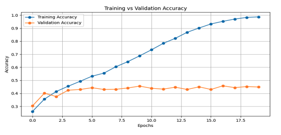
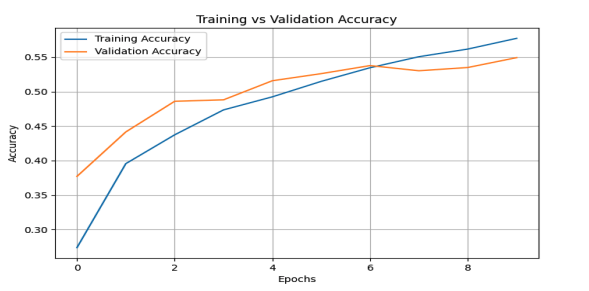
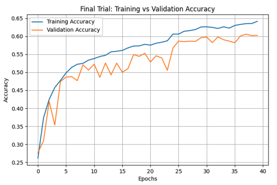

# Emotion-Detection

**🤖 Emotion Detection Robot Assistant** This project is an AI-powered Emotion Detection Robot that analyzes a user's facial emotion in real-time and responds accordingly using natural conversation. It combines deep learning for emotion classification with conversational AI and voice synthesis to create a responsive, empathetic assistant.

-----
## 🧠 How It Works

- A Convolutional Neural Network (CNN) trained on facial emotion datasets detects the user's current emotional state.
- The detected emotion is used as a contextual input to tailor responses from OpenAI's GPT (ChatGPT) API.
- Responses are then voiced using Eleven Labs' voice synthesis API, creating a smooth and expressive audio interaction.
- The assistant reacts differently based on emotions like happy, sad, angry, surprised, etc., offering more human-like engagement.

-----

## 🛠️ Technologies and Data set Used

- TensorFlow / Keras – For CNN-based emotion classification
- MobileNetV2 - Lightweight and fast**, ideal for embedded/mobile scenarios
- EfficientNetB0 – Lightweight, high-accuracy backbone for real-time inference
- OpenAI GPT API – To generate emotionally aware responses
- Eleven Labs API – For high-quality speech synthesis
- Flask / Streamlit / PyQt (optional) – For interactive UI (customizable)
- OpenCV – For live webcam feed and face detection
- Ideal for therapy bots, customer service kiosks, or personal digital assistants where empathetic interaction enhances user experience
- FER-2013 dataset

----

## 💡 Use Case

Ideal for therapy bots, customer service kiosks, or personal digital assistants where empathetic interaction enhances user experience.

----

### 📊 Model Training Summary

### Trial #0

| Epoch | Training Accuracy | Validation Accuracy | Validation Loss |
|-------|-------------------|---------------------|-----------------|
| 1     | 24.84%            | 30.45%              | 1.7278          |
| 2     | 33.59%            | 40.15%              | 1.5921          |
| 3     | 41.11%            | 37.57%              | 1.5819          |
| 4     | 45.72%            | 42.46%              | 1.4935          |
| 5     | 50.13%            | 43.02%              | 1.4738          |
| 6     | 54.05%            | 44.34%              | 1.4694          |
| 7     | 57.51%            | 43.02%              | 1.5424          |
| 8     | 61.34%            | 43.16%              | 1.5627          |
| 9     | 64.34%            | 44.13%              | 1.5963          |
| 10    | 69.85%            | 45.60%              | 1.6096          |
| 11    | 75.47%            | 43.92%              | 1.7635          |
| 12    | 78.93%            | 43.30%              | 1.9147          |
| 13    | 83.36%            | 44.76%              | 2.0202          |
| 14    | 87.78%            | 44.32%              | 2.2199          |
| 15    | 91.36%            | 45.04%              | 2.3622          |
| 16    | 93.60%            | 43.02%              | 2.7045          |
| 17    | 95.00%            | 45.81%              | 2.8669          |
| 18    | 97.77%            | 44.41%              | 3.1052          |
| 19    | 98.22%            | 45.25%              | 3.3375          |
| 20    | 99.10%            | 44.90%              | 3.6605          |

### Trial #2

| Epoch | Training Accuracy | Validation Accuracy | Validation Loss |
|-------|-------------------|---------------------|-----------------|
| 1     | 23.69%            | 37.71%              | 1.6133          |
| 2     | 38.73%            | 44.16%              | 1.4401          |
| 3     | 43.35%            | 48.60%              | 1.3738          |
| 4     | 47.13%            | 48.81%              | 1.3438          |
| 5     | 48.51%            | 51.58%              | 1.2861          |
| 6     | 51.75%            | 52.60%              | 1.2681          |
| 7     | 53.70%            | 53.77%              | 1.2477          |
| 8     | 55.00%            | 53.02%              | 1.2424          |
| 9     | 56.29%            | 53.49%              | 1.2233          |
| 10    | 57.84%            | 54.92%              | 1.1954          |

### Trial #3 

| Epoch | Training Accuracy | Validation Accuracy | Validation Loss |
|:-----:|:-----------------:|:-------------------:|:---------------:|
| 1     | 23.26%             | 27.66%              | 1.7777          |
| 5     | 46.84%             | 47.43%              | 1.3641          |
| 10    | 53.33%             | 50.62%              | 1.2863          |
| 20    | 57.72%             | 55.27%              | 1.1896          |
| 30    | 62.74%             | 59.61%              | 1.0840          |
| 40    | 64.11%             | 60.23%              | 1.0540          |

### Trial #4 

| Epoch | Training Accuracy | Validation Accuracy | Validation Loss |
|:-----:|:-----------------:|:-------------------:|:---------------:|
| 1     | 23.05%             | 29.56%              | 1.7268          |
| 5     | 40.76%             | 39.19%              | 1.5437          |
| 10    | 46.09%             | 48.48%              | 1.4691          |
| 15    | 50.01%             | 49.22%              | 1.3456          |
| 20    | 53.24%             | 54.28%              | 1.3250          |
| 25    | 56.45%             | 55.15%              | 1.2099          |
| 30    | 58.10%             | 57.50%              | 1.1797          |
| 35    | 59.58%             | 59.94%              | 1.0931          |
| 40    | 61.29%             | 59.94%              | 1.0599          |

### Trial 5

| Epoch | Training Accuracy | Validation Accuracy | Validation Loss |
|:-----:|:-----------------:|:-------------------:|:---------------:|
| 5     | 42.76%             | 47.60%              | 1.3738          |
| 10    | 50.99%             | 53.86%              | 1.1922          |
| 15    | 54.06%             | 56.51%              | 1.1331          |
| 20    | 56.01%             | 58.01%              | 1.0994          |
| 25    | 58.33%             | 59.58%              | 1.0698          |
| 30    | 59.57%             | 59.92%              | 1.0669          |
| 35    | 61.06%             | 60.46%              | 1.0415          |
| 40    | 62.02%             | 61.41%              | 1.0383          |
| 45    | 63.15%             | 60.87%              | 1.0406          |
| 50    | 64.70%             | 61.15%              | 1.0295          |
| 55    | 65.52%             | 61.77%              | 1.0273          |
| 60    | 66.32%             | 62.12%              | 1.0334          |
| 65    | 68.05%             | 62.12%              | 1.0215          |
| 70    | 68.18%             | 62.61%              | 1.0167          |
| 75    | 69.45%             | 63.03%              | 1.0144          |
| 80    | 70.16%             | 62.89%              | 1.0257          |
| 85    | 71.00%             | 63.04%              | 1.0213          |
| 90    | 71.61%             | 62.84%              | 1.0201          |
| 95    | 73.24%             | 62.78%              | 1.0219          |
| 100   | 73.06%             | 62.75%              | 1.0393          |

### 📊 Results Comparison Table

| Trial     | Epochs | Training Accuracy | Validation Accuracy | Notes |
|-----------|--------|-------------------|----------------------|-------|
| Trial #0  | 20     | 99.10%            | 44.90%               | Overfitting due to bad datasplit |
| Trial #1  | 10     | 57.84%            | 54.92%               | Improved datasplit, but still fluctuates |
| Trial #2  | 15     | 42.92%            | 44.52%               | A slight decline from Trial #1 |
| Trial #3  | 40     | 64.10%            | 60.20%               | Learning Rate Scheduler, GlobalAvgPooling instead of Flatten, better augmentation |
| Trial #4  | 40     | 61.29%            | 60.00%               | Tweaked LR from Trial #3, Dropout reduced to 0.4, Added early stopping, contrast & brightness changes, denser FC layer |
| Trial #5  | 50     | 70.94%            | 64.24% ✅             | Used MobileNetV2 (last 50 layers trainable), ImageDataGenerator for augmentation, Layer-wise dropout, BatchNorm, ReduceLROnPlateau — Best performing baseline |

